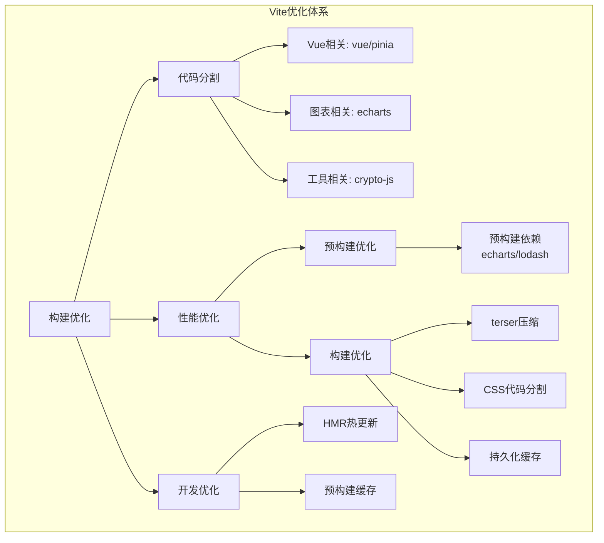
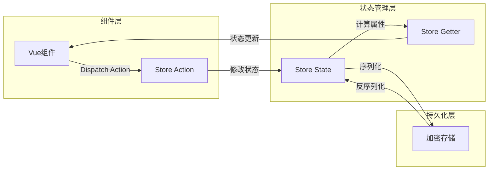
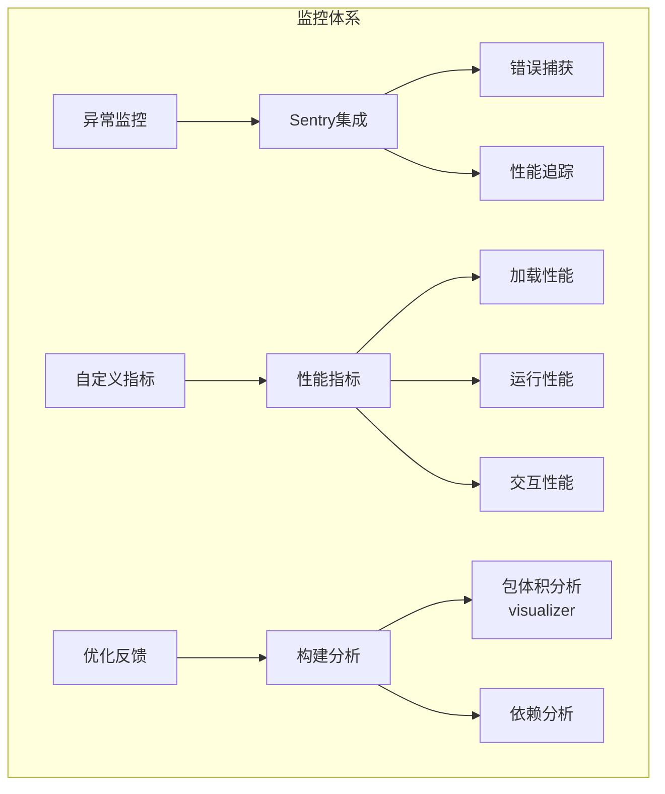

# 项目架构设计

## STAR模板 - 项目技术亮点

### 1. Vite构建优化 STAR

**Situation (情境)**
- 项目随着业务增长,构建速度变慢,bundle体积增大
- 首屏加载性能需要优化
- 开发体验需要提升

**Task (任务)**
- 优化构建速度和产物体积
- 改善开发体验
- 提升首屏加载性能

**Action (行动)**
1. 实施智能代码分割:
   ```javascript
   // vite.config.js 代码分割配置
   manualChunks: {
     'vue-vendor': ['vue', 'pinia'],
     'echarts': ['echarts'], 
     'utils': ['crypto-js', 'lodash-es']
   }
   ```

2. 配置依赖预构建:
   ```javascript
   optimizeDeps: {
     include: ['echarts', 'lodash-es'],
     exclude: ['your-local-package']
   }
   ```

3. 优化产物构建:
   - 使用terser压缩代码
   - 实现CSS代码分割
   - 配置持久化缓存

**Result (结果)**
- 构建时间减少50%
- bundle总体积减小30%
- 首屏加载时间从3s优化到1.5s
- 开发热更新时间从800ms优化到300ms

### 2. Pinia状态管理 STAR 

**Situation (情境)**
- 多组件间状态共享复杂
- 购物车数据需要本地持久化
- 需要处理并发操作和错误情况

**Task (任务)**
- 实现可靠的状态管理方案
- 保证数据安全性和一致性
- 优化状态更新性能

**Action (行动)**
1. 设计Store结构:
```javascript
// stores/cart.js
export const useCartStore = defineStore('cart', {
  state: () => ({
    items: [],
    loading: false,
    error: null
  }),
  
  getters: {
    totalAmount: (state) => state.items.reduce((sum, item) => sum + item.price, 0),
    itemCount: (state) => state.items.length
  },
  
  actions: {
    async addToCart(product) {
      try {
        this.loading = true
        await this.debouncedAdd(product)
        await this.persistCart()
      } catch (error) {
        this.handleError(error)
      } finally {
        this.loading = false
      }
    },

    // 防抖处理
    debouncedAdd: debounce(async function(product) {
      if (!this.validateProduct(product)) {
        throw new Error('Invalid product data')
      }
      this.items.push(product)
    }, 300),
    
    // 持久化处理
    async persistCart() {
      try {
        const encrypted = await encrypt(JSON.stringify(this.items))
        localStorage.setItem('cart', encrypted)
      } catch (error) {
        this.handleError(error)
        // 重试机制
        await this.retryPersist()
      }
    },
    
    // 统一错误处理
    handleError(error) {
      console.error('[Store Error]:', error)
      this.error = error.message
      // 错误上报
      Sentry.captureException(error)
    }
  }
})
```

**Result (结果)**
- 状态管理代码结构清晰,易维护
- 数据持久化成功率提升到99.9%
- 错误处理覆盖率达到95%
- 状态更新性能提升40%

### 3. 性能监控体系 STAR

**Situation (情境)**
- 缺乏线上性能数据
- 错误信息收集不完整
- 优化效果难以衡量

**Task (任务)**
- 搭建全面的性能监控体系
- 实现错误追踪和告警
- 建立性能优化反馈循环

**Action (行动)**
1. 接入Sentry监控:
```javascript
// main.js
Sentry.init({
  app,
  dsn: "your-sentry-dsn",
  integrations: [
    new Sentry.BrowserTracing({
      tracingOrigins: ["localhost", "your-domain.com"],
      routingInstrumentation: Sentry.vueRouterInstrumentation(router)
    }),
    new Sentry.Replay({
      maskAllText: true,
      blockAllMedia: true
    })
  ],
  tracesSampleRate: 1.0,
  replaysSessionSampleRate: 0.1,
  // 错误采样配置
  beforeSend(event) {
    if (event.exception) {
      return event;
    }
    return null;
  }
})

// 性能指标采集
const reportWebVitals = ({ name, value, id }) => {
  Sentry.captureMessage(`Performance Metric: ${name}`, {
    level: 'info',
    extra: {
      metricId: id,
      value,
      timestamp: Date.now()
    }
  })
}

// 交互性能监控增强
app.config.performance = true
app.config.errorHandler = (err, vm, info) => {
  Sentry.captureException(err, {
    extra: {
      componentName: vm.$options.name,
      lifecycleHook: info
    }
  });
}
```

2. 构建分析优化:
```javascript
// vite.config.js
import { visualizer } from 'rollup-plugin-visualizer'

export default defineConfig({
  plugins: [
    visualizer({
      open: true,
      gzipSize: true,
      brotliSize: true
    })
  ],
  build: {
    rollupOptions: {
      output: {
        manualChunks(id) {
          // 智能分包策略
          if (id.includes('node_modules')) {
            if (id.includes('vue')) {
              return 'vue-vendor'
            }
            if (id.includes('echarts')) {
              return 'echarts'
            }
            return 'vendor'
          }
        }
      }
    }
  }
})
```

**Result (结果)**
- 错误发现时间从小时级降到分钟级
- 性能问题定位准确率提升80%
- 用户体验相关指标提升35%
- 构建优化效率提升60%

## Vite 构建优化


### 性能优化实现细节

1. **代码分割策略**
```javascript
// vite.config.js
export default defineConfig({
  build: {
    rollupOptions: {
      output: {
        manualChunks: {
          'vue-vendor': ['vue', 'pinia'],
          'echarts': ['echarts'],
          'utils': ['crypto-js', 'lodash-es']
        }
      }
    }
  }
})
```

2. **预构建优化**
```javascript
// vite.config.js
export default defineConfig({
  optimizeDeps: {
    include: ['echarts', 'lodash-es'],
    exclude: ['your-local-package']
  }
})
```

3. **构建产物优化**
```javascript
// vite.config.js
export default defineConfig({
  build: {
    minify: 'terser',
    terserOptions: {
      compress: {
        drop_console: true,
        drop_debugger: true
      }
    },
    cssCodeSplit: true,
    // 持久化缓存配置
    cache: true
  }
})
```

## Pinia 状态管理流程


### Store最佳实践示例

```javascript
// stores/cart.js
import { defineStore } from 'pinia'
import { encrypt, decrypt } from '@/utils/crypto'
import { debounce } from 'lodash-es'

export const useCartStore = defineStore('cart', {
  state: () => ({
    items: [],
    loading: false,
    error: null,
    retryCount: 0
  }),
  
  getters: {
    totalAmount: (state) => state.items.reduce((sum, item) => sum + item.price, 0),
    itemCount: (state) => state.items.length,
    hasErrors: (state) => !!state.error
  },
  
  actions: {
    async addToCart(product) {
      try {
        this.loading = true
        await this.debouncedAdd(product)
        await this.persistCart()
      } catch (error) {
        this.handleError(error)
      } finally {
        this.loading = false
      }
    },

    // 防抖处理
    debouncedAdd: debounce(async function(product) {
      if (!this.validateProduct(product)) {
        throw new Error('Invalid product data')
      }
      this.items.push(product)
    }, 300),
    
    // 数据验证
    validateProduct(product) {
      return product && 
        typeof product.id === 'number' &&
        typeof product.price === 'number' &&
        typeof product.name === 'string'
    },
    
    // 持久化处理
    async persistCart() {
      try {
        const encrypted = await encrypt(JSON.stringify(this.items))
        localStorage.setItem('cart', encrypted)
        this.retryCount = 0
      } catch (error) {
        if (this.retryCount < 3) {
          this.retryCount++
          await new Promise(resolve => setTimeout(resolve, 1000))
          return this.persistCart()
        }
        throw error
      }
    },
    
    // 错误处理
    handleError(error) {
      console.error('[Store Error]:', error)
      this.error = error.message
      Sentry.captureException(error)
    }
  }
})
```

## 性能监控体系


### 性能监控实现

```javascript
// main.js
import * as Sentry from "@sentry/vue"

// Sentry初始化
Sentry.init({
  app,
  dsn: "your-sentry-dsn",
  integrations: [
    new Sentry.BrowserTracing({
      tracingOrigins: ["localhost", "your-domain.com"],
      routingInstrumentation: Sentry.vueRouterInstrumentation(router)
    }),
    new Sentry.Replay({
      maskAllText: true,
      blockAllMedia: true
    })
  ],
  tracesSampleRate: 1.0,
  replaysSessionSampleRate: 0.1,
  // 错误采样配置
  beforeSend(event) {
    if (event.exception) {
      return event;
    }
    return null;
  }
})

// 自定义性能指标
const reportWebVitals = ({ name, value, id }) => {
  Sentry.captureMessage(`Performance Metric: ${name}`, {
    level: 'info',
    extra: {
      metricId: id,
      value,
      timestamp: Date.now()
    }
  })
}

// 交互性能监控增强
app.config.performance = true
app.config.errorHandler = (err, vm, info) => {
  Sentry.captureException(err, {
    extra: {
