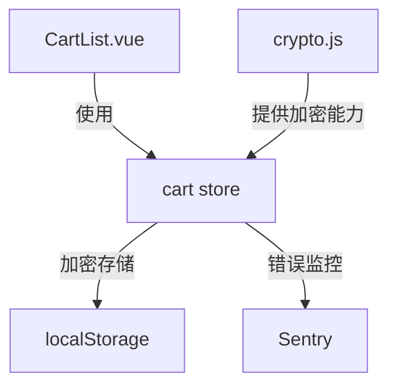

# 购物车项目优化设计文档

## 架构图


## 模块职责说明

### 1. 加密模块 (src/utils/crypto.js)
- 提供 AES 加密/解密功能
- 使用固定密钥加密
- 确保数据在 localStorage 中安全存储

### 2. 购物车状态管理 (src/stores/cart.js)
- 集成加密模块进行数据持久化
- 添加 Sentry 错误监控
- 优化计算属性性能（防抖）

### 3. 商品列表组件 (src/components/CartList.vue)
- 使用 v-memo 优化静态内容渲染
- 优化重复计算逻辑

## 技术选型理由

### 1. AES 加密 (crypto-js)
- 业界标准加密算法
- 适合小型数据加密
- 性能开销可接受

### 2. Sentry 错误监控
- 提供详细的错误堆栈信息
- 支持性能监控
- 易于集成 Vue 应用

### 3. 性能优化策略
- v-memo: 适用于大列表静态内容优化
- 防抖: 避免频繁计算总价
- 优化持久化序列化过程

## 实现步骤

1. 安装依赖:
```bash
npm install crypto-js @sentry/vue @sentry/tracing
```

2. 实现加密模块:
- 创建 crypto.js
- 实现加密/解密方法
- 添加密钥管理

3. 更新购物车 Store:
- 集成加密序列化
- 添加错误监控
- 优化计算属性

4. 优化商品列表组件:
- 添加 v-memo 指令
- 实现总价计算防抖

## 潜在风险与解决方案

1. 加密性能开销
- 仅在必要时进行序列化/反序列化
- 考虑使用 Web Workers 处理加密逻辑

2. 密钥管理
- 使用环境变量存储密钥
- 考虑实现密钥轮换机制

3. 错误处理
- 完善错误边界处理
- 添加数据恢复机制

## 学习要点总结

1. 安全性考虑
- 本地存储加密的重要性
- 密钥管理最佳实践

2. 性能优化
- Vue 3 性能优化特性
- 计算属性优化策略

3. 错误监控
- 前端异常捕获
- 监控系统集成
