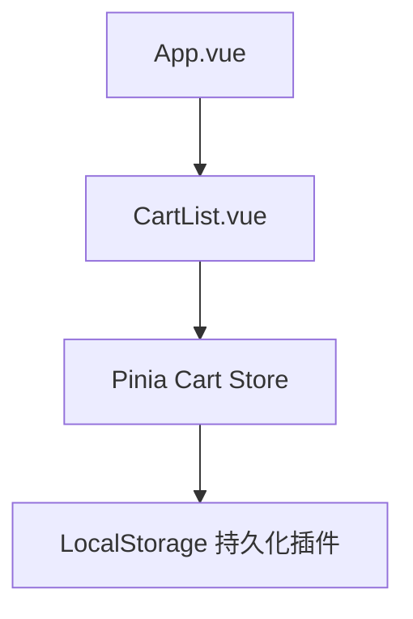

# 设计思路文档

## 架构图

## 模块职责说明
- **App.vue**: 主应用入口文件，负责加载全局组件并配置全局状态。
- **components/CartList.vue**: 展示购物车列表，包含商品显示、删除功能与总计计算；利用 `v-memo` 指令缓存静态列表以优化渲染性能。
- **stores/cart.js**: 使用 Pinia 实现购物车状态管理，封装了商品的增删改查逻辑；内置 `persist` 插件实现 localStorage 持久化存储，保证数据刷新后仍然存在。
- **持久化存储**: 依赖 Pinia 持久化插件，将购物车数据存储在 localStorage 中，提高用户体验，防止数据丢失。

## 关键技术选型理由
- **Pinia 状态管理**  
  [CONCEPT]: Pinia 是 Vue 官方推荐的状态管理方案，其 API 简洁、性能优越、易于与 Vue 3 的组合式 API 集成。  
  [PATTERN]: 单一职责原则，业务逻辑集中在 store 中，组件只负责展示。

- **组合式 API**  
  [CONCEPT]: 通过组合式 API 可以更好地组织业务逻辑，使代码易于维护和复用。  
  使用 computed 缓存总计计算，防止重复运算，提升性能。

- **v-memo 指令**  
  [PERF]: 利用 v-memo 缓存静态列表渲染结果，减少不必要的 DOM 更新，确保组件性能最优化。

- **节流处理**  
  [PERF]: 对购物车数据变化进行节流（示例中以伪代码给出），实际项目可使用 lodash.throttle 实现数据更新的高频调控，防止性能瓶颈。

## 学习要点总结
1. **[CONCEPT]** 使用 Pinia 与组合式 API 分离业务逻辑和视图展示，保障代码模块化与高内聚低耦合。  
2. **[PATTERN]** 单一职责原则的实现：组件仅负责视图渲染，所有业务逻辑交由 store 处理。  
3. **[PERF]** 通过 `v-memo` 缓存静态列表及 computed 缓存总价计算，优化组件性能。  
4. 持久化存储设计确保购物车数据在页面刷新后依然保留，增强用户体验。  
5. 错误写法示例与正确实现对比注释帮助开发者理解关键逻辑和避免常见错误。  
6. 参考资料：  
   - [Pinia 官方文档](https://pinia.vuejs.org/)  
   - [Vue 3 组合式 API 指南](https://v3.vuejs.org/guide/composition-api-introduction.html)
