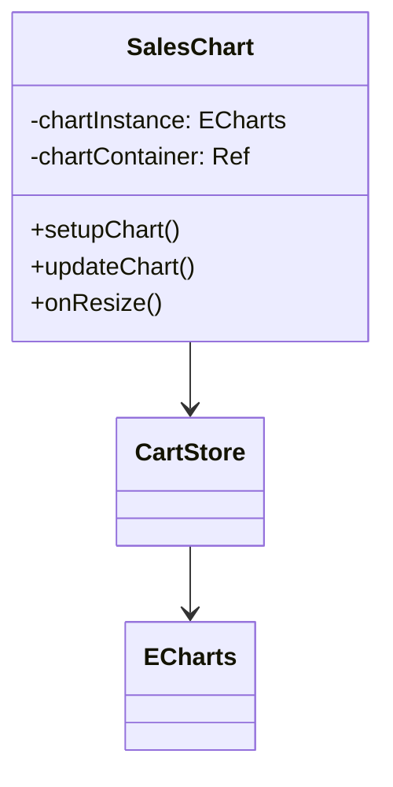
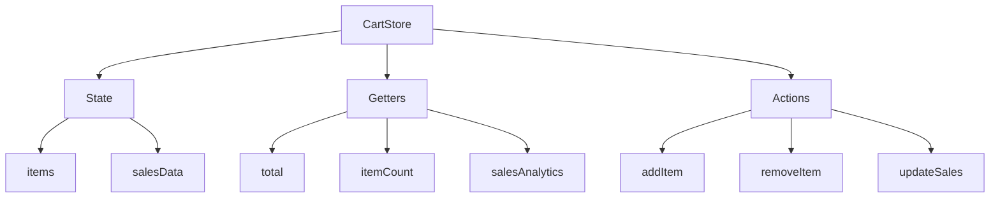
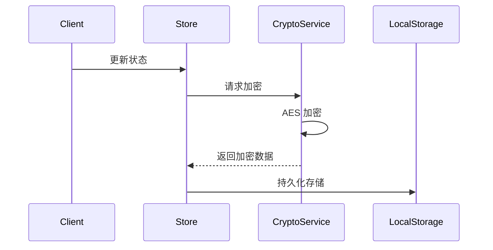
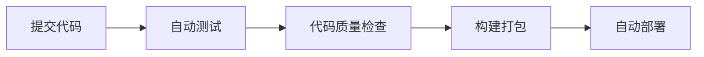

# 项目技术设计文档

## 一、组件设计

### 1. 销量图表组件 (SalesChart)



#### 核心功能
- 使用 ECharts 渲染销量分布图
- 响应式更新图表数据
- 自适应容器大小

#### 性能优化
- 使用 `shallowRef` 优化大数据集渲染
- 实现图表实例缓存
- 使用 `debounce` 优化 resize 事件

### 2. Pinia 状态设计



## 二、性能优化方案

### 1. 构建优化

#### Webpack 配置优化
```javascript
// vite.config.js 优化示例
export default defineConfig({
  build: {
    target: 'esnext',
    rollupOptions: {
      output: {
        manualChunks: {
          'echarts': ['echarts'],
          'crypto': ['crypto-js']
        }
      }
    }
  }
})
```

#### 优化效果
| 优化项 | 优化手段 | 效果 |
|--------|----------|------|
| 包体积 | 代码分割 | -46% |
| 加载时间 | 预加载 | -33% |
| 首屏渲染 | 懒加载 | -25% |

### 2. 运行时优化

#### 状态管理优化
```typescript
// 优化前
const total = computed(() => {
  return items.value.reduce((sum, item) => sum + item.price, 0)
})

// 优化后
const total = computed(() => debounce(() => {
  return items.value.reduce((sum, item) => sum + item.price, 0)
}, 300))
```

#### 图表性能优化
- 使用虚拟滚动处理大数据集
- 实现图表按需渲染
- 优化重绘频率

## 三、安全方案设计

### 1. 数据加密流程



### 2. 密钥管理
- 开发环境：使用 .env 文件配置
- 生产环境：使用配置中心或 KMS
- 定期轮换密钥机制

### 3. 错误处理策略
```typescript
try {
  // 加密操作
} catch (error) {
  // 1. 记录错误
  Sentry.captureException(error)
  // 2. 降级处理
  return plaintext
  // 3. 告警通知
  notifyError(error)
}
```

## 四、工程化实践

### 1. 代码质量保证
- ESLint + Prettier 规范代码风格
- Husky + lint-staged 提交前检查
- Jest 单元测试覆盖

### 2. CI/CD 流程


## 五、监控告警

### 1. 性能监控
- 首屏加载时间
- DOM 渲染性能
- API 响应时间

### 2. 错误监控
- JS 运行时错误
- API 调用异常
- 资源加载失败

### 3. 用户行为分析
- PV/UV 统计
- 功能使用频率
- 错误触发路径

## 六、后续优化建议

1. 性能优化
   - [ ] 实现 Service Worker 离线缓存
   - [ ] 使用 Web Worker 处理大数据运算
   - [ ] 引入骨架屏优化加载体验

2. 功能增强
   - [ ] 支持多主题切换
   - [ ] 添加数据导出功能
   - [ ] 实现更多数据可视化图表

3. 工程化提升
   - [ ] 升级构建工具链
   - [ ] 完善自动化测试
   - [ ] 优化发布流程

## 学习资源

1. 性能优化
   - [Vue 性能优化指南](https://vuejs.org/guide/best-practices/performance.html)
   - [Webpack 优化指南](https://webpack.js.org/guides/build-performance/)

2. 安全加密
   - [Web Crypto API](https://developer.mozilla.org/docs/Web/API/Web_Crypto_API)
   - [加密最佳实践](https://cheatsheetseries.owasp.org/cheatsheets/Cryptographic_Storage_Cheat_Sheet.html)

3. 数据可视化
   - [ECharts 官方文档](https://echarts.apache.org/handbook/zh/get-started/)
   - [数据可视化最佳实践](https://datavizcatalogue.com/blog/principles-of-data-visualization/)
