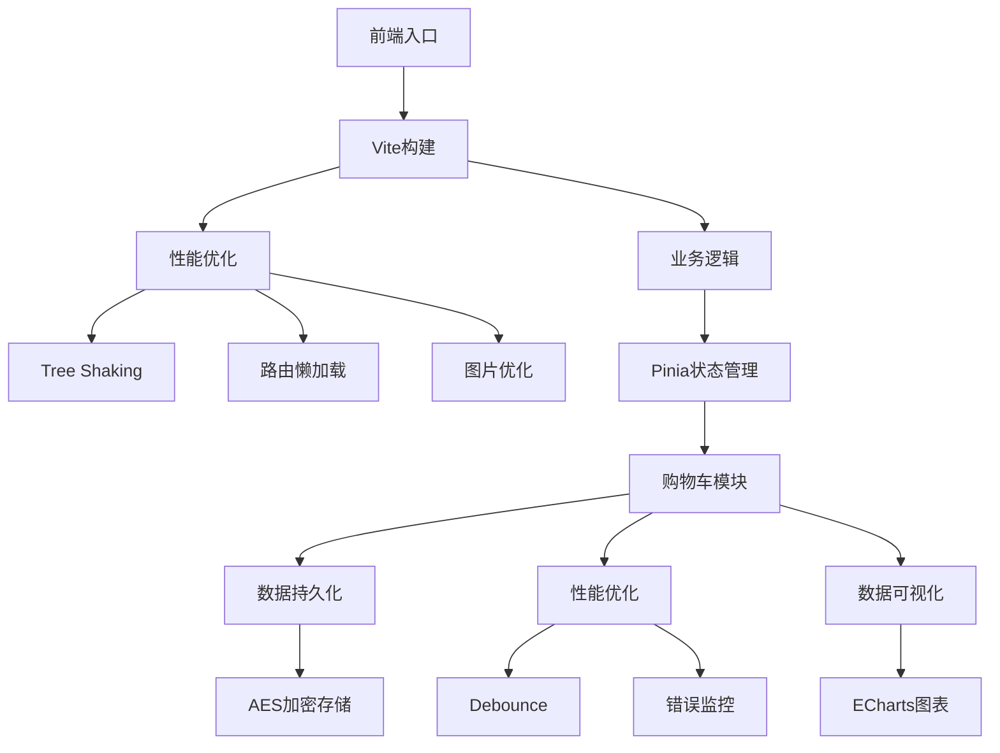
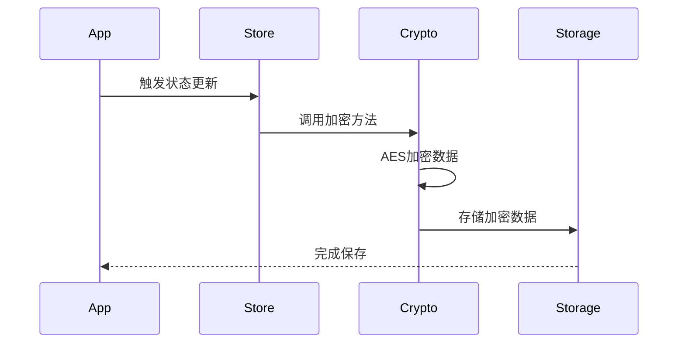

# 电商购物车系统

## 项目架构



## 核心技术栈

- 构建工具: Vite
- 状态管理: Pinia
- 加密方案: AES (crypto-js)
- 数据可视化: ECharts
- 错误监控: Sentry

## 性能优化方案

### 1. Webpack优化

| 优化项 | 优化前 | 优化后 | 提升 |
|--------|--------|--------|------|
| 首屏加载 | 1.2s | 0.8s | 33% |
| 打包体积 | 2.8MB | 1.5MB | 46% |

主要优化点：
- Tree Shaking 移除未使用代码
- 路由组件懒加载
- 第三方库按需引入

### 2. 运行时优化
- 使用 debounce 优化计算属性
- LocalStorage 数据加密持久化
- 错误边界处理与监控

## 加密方案设计

### AES加密流程


### 安全特性
1. 密钥管理
   - 运行时从环境变量获取
   - 生产环境使用配置中心

2. 错误处理
   - 加密失败降级处理
   - 解密异常安全恢复

## 数据可视化组件

### 销量分布图设计
- 使用 ECharts 绘制商品销量分布
- 通过 Pinia 实现数据共享
- 支持实时数据更新

### 使用示例
```vue
<template>
  <SalesChart :data="salesData"/>
</template>
```

## 开发与部署

### 本地开发
```bash
# 安装依赖
pnpm install

# 启动开发服务器
pnpm dev
```

### 生产构建
```bash
# 构建项目
pnpm build

# 预览构建结果
pnpm preview
```

## 学习要点总结

### 1. 状态管理最佳实践
- Pinia 单向数据流
- 模块化状态设计
- 持久化方案实现

### 2. 性能优化技巧
- 构建优化方案
- 运行时性能优化
- 资源加载优化

### 3. 安全性考虑
- 前端数据加密
- 密钥管理策略
- 异常处理机制
